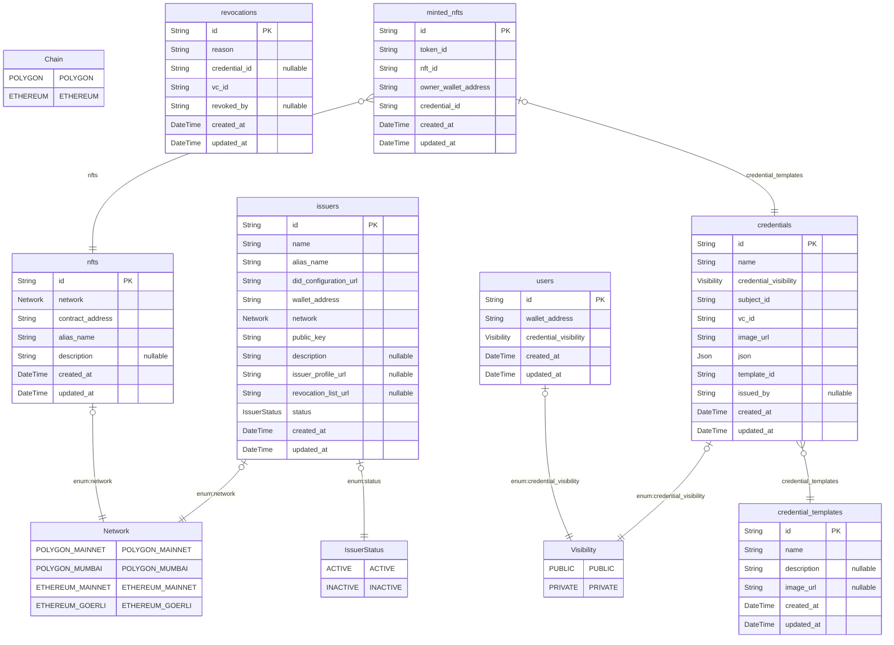

```mermaid
erDiagram

        Chain {
            POLYGON POLYGON
ETHEREUM ETHEREUM
        }


        Network {
            POLYGON_MAINNET POLYGON_MAINNET
POLYGON_MUMBAI POLYGON_MUMBAI
ETHEREUM_MAINNET ETHEREUM_MAINNET
ETHEREUM_GOERLI ETHEREUM_GOERLI
        }


        IssuerStatus {
            ACTIVE ACTIVE
INACTIVE INACTIVE
        }


        Visibility {
            PUBLIC PUBLIC
PRIVATE PRIVATE
        }

  issuers {
    String id PK
    String name
    String alias_name
    String did_configuration_url
    String wallet_address
    Network network
    String public_key
    String description  "nullable"
    String issuer_profile_url  "nullable"
    String revocation_list_url  "nullable"
    IssuerStatus status
    DateTime created_at
    DateTime updated_at
    }


  credential_templates {
    String id PK
    String name
    String description  "nullable"
    String image_url  "nullable"
    DateTime created_at
    DateTime updated_at
    }


  credentials {
    String id PK
    String name
    Visibility credential_visibility
    String subject_id
    String vc_id
    String image_url
    Json json
    String template_id
    String issued_by  "nullable"
    DateTime created_at
    DateTime updated_at
    }


  revocations {
    String id PK
    String reason
    String credential_id  "nullable"
    String vc_id
    String revoked_by  "nullable"
    DateTime created_at
    DateTime updated_at
    }


  nfts {
    String id PK
    Network network
    String contract_address
    String alias_name
    String description  "nullable"
    DateTime created_at
    DateTime updated_at
    }


  minted_nfts {
    String id PK
    String token_id
    String nft_id
    String owner_wallet_address
    String credential_id
    DateTime created_at
    DateTime updated_at
    }


  users {
    String id PK
    String wallet_address
    Visibility credential_visibility
    DateTime created_at
    DateTime updated_at
    }

    issuers o|--|| Network : "enum:network"
    issuers o|--|| IssuerStatus : "enum:status"
    credentials o|--|| Visibility : "enum:credential_visibility"
    credentials o{--|| credential_templates : "credential_templates"
    nfts o|--|| Network : "enum:network"
    minted_nfts o{--|| nfts : "nfts"
    minted_nfts o|--|| credentials : "credential_templates"
    users o|--|| Visibility : "enum:credential_visibility"
```
